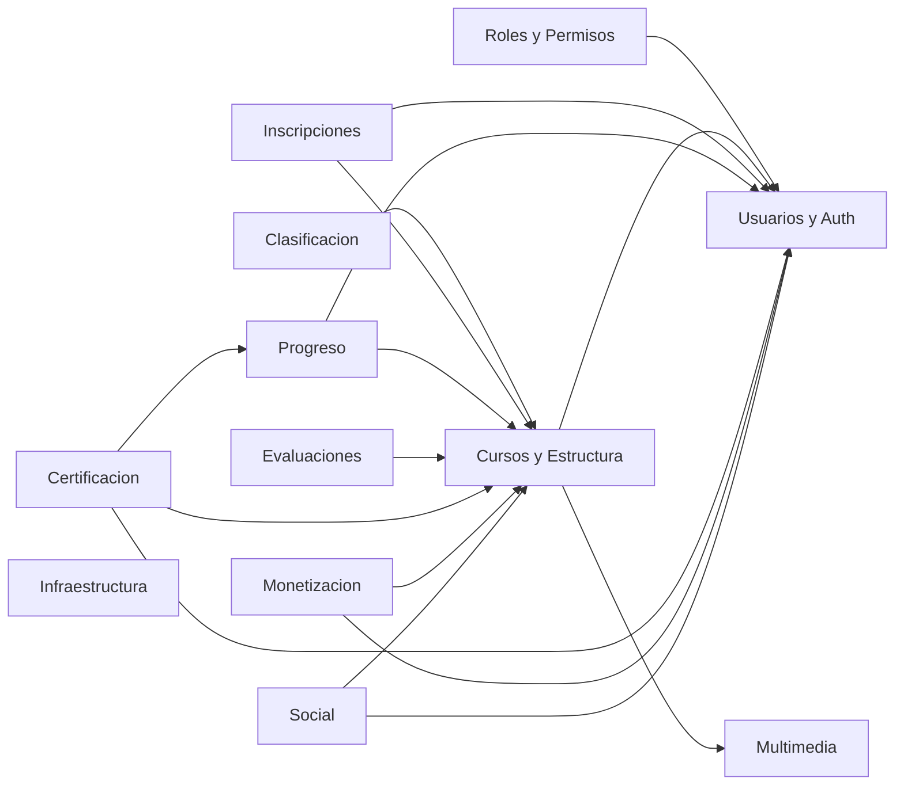

# Plan de Desarrollo Modular para Mentora
Objetivos
- Entregar valor incremental por módulos independientes y desplegables.
- Mantener límites claros de datos y lógica por módulo.
- Evitar acoplamientos fuertes; usar contratos estables y eventos.
- Asegurar pruebas, seeds y observabilidad en cada entrega.

Principios de diseño
- Propietario único por tabla: cada tabla pertenece a un solo módulo.
- Dependencias solo hacia capas de contrato, no a implementaciones.
- Integración asíncrona preferente mediante eventos de dominio.
- Recursos REST y políticas por módulo; políticas cruzadas vía permisos.
- Feature flags cuando aplique para habilitar por etapas.

Mapa de módulos y propiedad de datos

1. Usuarios y Autenticación
   - Tablas: users, password_reset_tokens, sessions, oauth_auth_codes, oauth_access_tokens, oauth_refresh_tokens, oauth_clients, oauth_device_codes
   - Responsabilidades: registro, login, verificación de email, gestión de tokens OAuth2, sesiones.
   - Exposición: API REST de perfil y autenticación; eventos UserRegistered, UserVerified.

2. Roles y Permisos
   - Tablas: roles, permissions, model_has_roles, model_has_permissions, role_has_permissions
   - Responsabilidades: RBAC con guardias, asignación de roles y permisos a usuarios y modelos.
   - Exposición: endpoints de administración de roles y permisos; políticas; middleware.

3. Cursos y Estructura
   - Tablas: courses, course_sections, course_lessons, course_instructors
   - Responsabilidades: catálogo de cursos, secciones y lecciones, instructores.
   - Exposición: APIs de curso, sección y lección; eventos CoursePublished.

4. Clasificación y Descubrimiento
   - Tablas: categories, course_category, tags, course_tag
   - Responsabilidades: taxonomías, etiquetado y filtrado.
   - Exposición: APIs de categorías y tags.

5. Inscripciones
   - Tablas: enrollments
   - Responsabilidades: alta de usuarios a cursos, expiraciones.
   - Exposición: endpoints de inscripción; eventos EnrollmentCreated, EnrollmentExpired.

6. Progreso de Aprendizaje
   - Tablas: lesson_progress, course_progress
   - Responsabilidades: tracking de progreso por lección y curso.
   - Exposición: APIs de progreso; eventos LessonCompleted, CourseCompleted.

7. Evaluaciones
   - Tablas: quizzes, quiz_questions, quiz_options, quiz_attempts, quiz_answers
   - Responsabilidades: cuestionarios, intentos, calificaciones.
   - Exposición: APIs de quiz y calificación; eventos QuizPassed, QuizFailed.

8. Certificación
   - Tablas: certificate_templates, certificates
   - Responsabilidades: emisión de certificados, plantillas.
   - Exposición: endpoints de emisión y verificación; eventos CertificateIssued.

9. Monetización
   - Tablas: subscription_plans, plan_course, user_subscriptions, payment_transactions, coupons, coupon_redemptions
   - Responsabilidades: planes, suscripciones, pagos y cupones.
   - Exposición: APIs de suscripción y pago; eventos PaymentCaptured, SubscriptionActivated, SubscriptionCanceled, CouponRedeemed.

10. Multimedia
    - Tablas: media_assets, lesson_media
    - Responsabilidades: biblioteca de medios y enlaces a lecciones.
    - Exposición: APIs de media; políticas de acceso por permisos y propiedad.

11. Social y Feedback
    - Tablas: course_reviews, wishlists
    - Responsabilidades: reseñas y listas de deseo.
    - Exposición: APIs de reviews y wishlists.

12. Infraestructura de Plataforma
    - Tablas: jobs, job_batches, failed_jobs, cache, cache_locks
    - Responsabilidades: colas, caching y tareas en segundo plano.
    - Exposición: métricas operativas y panel de administración interno.

Dependencias permitidas entre módulos
- Usuarios y Autenticación: sin dependencias entrantes obligatorias.
- Roles y Permisos depende de Usuarios para asignar a user models.
- Cursos y Estructura depende de Usuarios para created_by y de Multimedia para assets.
- Clasificación no depende de otros módulos funcionales.
- Inscripciones depende de Usuarios y Cursos.
- Progreso depende de Usuarios y Cursos.
- Evaluaciones depende de Cursos y Progreso opcionalmente para gating.
- Certificación depende de Usuarios, Cursos y Progreso.
- Monetización depende de Usuarios y Cursos.
- Social depende de Usuarios y Cursos.
- Infra provee servicios transversales, no depende de módulos funcionales.

Diagrama de dependencias

Contratos entre módulos
- REST JSON: endpoints estables versionados por módulo bajo /api
- Eventos de dominio: publicados en bus de eventos interno para integración desacoplada.
- Autorización: middleware de autenticación y permisos RBAC en capa API.

Ejemplos de API y eventos por prioridad inicial

Módulo Usuarios y Autenticación
- API
  - POST /api/auth/login
  - POST /api/auth/register
  - POST /api/auth/logout
  - GET  /api/auth/me
  - POST /api/auth/refresh
  - POST /api/auth/password/forgot
  - POST /api/auth/password/reset
  - POST /api/auth/email/verify
- Eventos
  - UserRegistered, UserVerified, UserLoggedIn, UserPasswordReset
- Datos iniciales
  - Seeder de cuenta admin y usuario demo usando [database/seeders/DefaultUserSeeder.php](database/seeders/DefaultUserSeeder.php)

Módulo Roles y Permisos
- API
  - GET    /api/rbac/roles
  - POST   /api/rbac/roles
  - PATCH  /api/rbac/roles/{id}
  - DELETE /api/rbac/roles/{id}
  - GET    /api/rbac/permissions
  - POST   /api/rbac/assign
  - POST   /api/rbac/revoke
- Eventos
  - RoleCreated, PermissionAssigned, PermissionRevoked
- Datos iniciales
  - Seeder base de RBAC usando [database/seeders/RbacSeeder.php](database/seeders/RbacSeeder.php)

Roadmap por fases

Fase 0 Fundaciones
- Configurar pipelines, estándares de código y plantillas de PR.
- Definir namespaces por módulo, providers y rutas agrupadas.
- Asegurar Passport y middleware de autenticación activos.
- Entregables: endpoints health, versionado, lint y tests base.
- Criterios de aceptación: CI verde, seguridad básica operativa.

Fase 1 Usuarios y Autenticación
- Implementar endpoints descritos, validaciones y políticas de perfil.
- Habilitar verificación de email y restablecimiento de contraseña.
- Emitir y revocar tokens de acceso OAuth2.
- Entregables: cobertura de pruebas funcionales de auth > 80 por ciento.
- Criterios de aceptación: flujo E2E login registro logout estable.

Fase 2 Roles y Permisos
- Modelado y servicios RBAC sobre tablas existentes.
- Middleware y políticas aplicadas a endpoints protegidos.
- Pantallas o endpoints de administración de roles y permisos.
- Entregables: seeds de rol admin y permisos críticos.
- Criterios de aceptación: control de acceso auditado y probado.

Fase 3 Cursos y Estructura
- CRUD de cursos, secciones y lecciones.
- Publicación y estados de curso; asignación de instructores.
- Integración con Multimedia para assets.

Fase 4 Clasificación
- CRUD de categorías y tags; asignación a cursos.

Fase 5 Inscripciones
- Alta, expiración y consulta de inscripciones.
- Eventos de inscripción para disparar progreso inicial.

Fase 6 Progreso
- Tracking de progreso por lección y curso.
- Cálculo de completion y eventos de finalización.

Fase 7 Evaluaciones
- Gestión de quizzes, intentos y calificación.
- Gating de progreso y emisión de eventos de evaluación.

Fase 8 Certificación
- Emisión de certificados basados en plantillas.
- Verificación pública por código.

Fase 9 Monetización
- Planes, suscripciones, pagos, cupones y redenciones.
- Integración con pasarela de pago elegida.

Fase 10 Social y Feedback
- Reseñas y wishlists con moderación básica.

Fase 11 Observabilidad e Infra
- Métricas, colas, reintentos, alertas y dashboards.

Pautas de implementación por módulo
- Rutas agrupadas bajo prefijo y middleware específicos.
- Controladores, FormRequests, Resources y Policies por módulo.
- Casos de uso orquestados por servicios de aplicación.
- Repositorios o queries dedicadas por agregado.
- Eventos de dominio y listeners registrados por módulo.
- Tests unitarios, de integración y de contrato de API.

Seguridad y cumplimiento
- Autenticación vía Passport y hashing de contraseñas robusto.
- Autorización con middleware de permisos y políticas.
- Validación estricta de entrada y rate limiting.
- Registros de auditoría en operaciones sensibles.

Datos y migraciones
- Migraciones ya presentes según [migrations_summary.md](migrations_summary.md).
- Orden de despliegue sugerido: Usuarios, RBAC, Cursos, Catálogos, Inscripciones, Progreso, Evaluaciones, Certificación, Monetización, Social, Multimedia.
- Seeds iniciales: usuarios por defecto y RBAC base.

KPIs y calidad
- Tasa de éxito de login, latencia de endpoints críticos, tasa de error 4xx 5xx.
- Cobertura de pruebas por módulo y SLIs de disponibilidad.

Riesgos y mitigación
- Acoplamiento entre módulos: mitigar con eventos y contratos versionados.
- Consistencia eventual: diseñar idempotencia y reintentos.
- Complejidad de permisos: documentar matriz y cubrir con tests.

Próximos pasos inmediatos
- Aprobación de este plan.
- Inicio de Fase 1 y Fase 2 en paralelo controlado: usuarios primero, RBAC acoplado a endpoints protegidos.
- Definir historias de usuario y criterios de aceptación detallados para Fase 1 2.

Fin del documento
## Decisiones de arquitectura confirmadas (Fase 1–2)

- RBAC sin teams (spatie/laravel-permission).
- Guards habilitados: web y api; endpoints protegidos bajo guard api.
- OAuth2 con Laravel Passport: Password Grant con refresh tokens desde el inicio; Authorization Code con PKCE planificado para fases futuras.
- Correo transaccional: Mailpit local en desarrollo.
- Convención de permisos: recurso.accion (por ejemplo: users.read, courses.create).

Impacto en el plan
- Las políticas y middleware de permisos se aplicarán sobre guard api.
- Las rutas de autenticación se proveerán bajo /api/auth y emitirán tokens vía Passport.
- Los eventos de dominio de usuario se usarán para desacoplar integraciones (notificaciones, auditoría).

---

## Plan de acción inmediato Fase 1 (Usuarios y Autenticación)

Entregables clave
- API de autenticación: login, register, logout, me, refresh, password/forgot, password/reset, email/verify.
- Tokens de acceso vía Passport (password grant + refresh).
- Verificación de correo y reset de contraseña operativos con Mailpit.
- Cobertura de pruebas funcionales de auth ≥ 80%.

Tareas técnicas
- Rutas:
  - Definir endpoints bajo prefijo /api/auth en [routes/api.php](routes/api.php).
- Controlador:
  - Ampliar [app/Http/Controllers/AuthController.php](app/Http/Controllers/AuthController.php) para métodos de registro, login, logout, me, refresh, forgotPassword, resetPassword, verifyEmail.
- Validaciones:
  - Crear FormRequests: [app/Http/Requests/Auth/RegisterRequest.php](app/Http/Requests/Auth/RegisterRequest.php), [app/Http/Requests/Auth/LoginRequest.php](app/Http/Requests/Auth/LoginRequest.php), [app/Http/Requests/Auth/ForgotPasswordRequest.php](app/Http/Requests/Auth/ForgotPasswordRequest.php), [app/Http/Requests/Auth/ResetPasswordRequest.php](app/Http/Requests/Auth/ResetPasswordRequest.php).
- Serialización:
  - UserResource: [app/Http/Resources/UserResource.php](app/Http/Resources/UserResource.php).
- Servicios de dominio:
  - Servicio de emisión/rotación de tokens: [app/Services/Auth/TokenService.php](app/Services/Auth/TokenService.php).
- Eventos y listeners:
  - Eventos: [app/Events/UserRegistered.php](app/Events/UserRegistered.php), [app/Events/UserVerified.php](app/Events/UserVerified.php), [app/Events/UserPasswordReset.php](app/Events/UserPasswordReset.php).
  - Listeners: [app/Listeners/SendWelcomeEmail.php](app/Listeners/SendWelcomeEmail.php), [app/Listeners/LogUserSecurityEvent.php](app/Listeners/LogUserSecurityEvent.php).
- Passport:
  - Ejecutar instalación de claves y clients (manual en terminal).
  - Configurar guard api en [config/auth.php](config/auth.php).
- Correo (Mailpit):
  - Ajustar .env con SMTP local (host 127.0.0.1, puerto 1025) y verificación de correo habilitada.
- Seeds:
  - Revisar/ejecutar seeder de base: [database/seeders/DefaultUserSeeder.php](database/seeders/DefaultUserSeeder.php).
- Pruebas:
  - Tests de feature: [tests/Feature/Auth/RegisterTest.php](tests/Feature/Auth/RegisterTest.php), [tests/Feature/Auth/LoginTest.php](tests/Feature/Auth/LoginTest.php), [tests/Feature/Auth/PasswordResetTest.php](tests/Feature/Auth/PasswordResetTest.php), [tests/Feature/Auth/EmailVerificationTest.php](tests/Feature/Auth/EmailVerificationTest.php).

Criterios de aceptación
- Registro, login, refresh y logout funcionando E2E con tokens válidos.
- Emails de verificación y reset entregados a Mailpit y flujos completos.
- Respuestas JSON estandarizadas mediante UserResource y códigos HTTP correctos.
- Logs de seguridad en eventos de autenticación.

Notas operativas
- Passport deberá emitir clients para password grant; documentar credenciales del client en vault local de desarrollo.
- Throttling de login y reset habilitado para mitigar abuso.

---

## Plan de acción inmediato Fase 2 (Roles y Permisos)

Entregables clave
- API de administración de roles y permisos.
- Asignación y revocación de roles/permisos a usuarios.
- Middleware de autorización aplicado a endpoints protegidos.
- Seeder base de RBAC con rol admin y permisos críticos.

Tareas técnicas
- Rutas:
  - Endpoints bajo /api/rbac en [routes/api.php](routes/api.php): roles (CRUD), permissions (listado), assign, revoke.
- Controladores:
  - [app/Http/Controllers/Rbac/RolesController.php](app/Http/Controllers/Rbac/RolesController.php)
  - [app/Http/Controllers/Rbac/PermissionsController.php](app/Http/Controllers/Rbac/PermissionsController.php)
  - [app/Http/Controllers/Rbac/AssignmentsController.php](app/Http/Controllers/Rbac/AssignmentsController.php)
- Validaciones:
  - Requests: [app/Http/Requests/Rbac/RoleStoreRequest.php](app/Http/Requests/Rbac/RoleStoreRequest.php), [app/Http/Requests/Rbac/RoleUpdateRequest.php](app/Http/Requests/Rbac/RoleUpdateRequest.php), [app/Http/Requests/Rbac/AssignmentRequest.php](app/Http/Requests/Rbac/AssignmentRequest.php).
- Autorización:
  - Registrar middleware de spatie en kernel y configurar guard api en [config/permission.php](config/permission.php) y [config/auth.php](config/auth.php).
  - Políticas de recursos de ejemplo (aplicables desde Fase 3): [app/Policies/CoursePolicy.php](app/Policies/CoursePolicy.php).
- Seeds:
  - Confirmar/ajustar [database/seeders/RbacSeeder.php](database/seeders/RbacSeeder.php) con:
    - Rol: admin
    - Permisos iniciales: users.read, users.update, users.delete, roles.read, roles.create, roles.update, roles.delete, permissions.read, courses.read, courses.create, courses.update, courses.delete
- Pruebas:
  - [tests/Feature/Rbac/RolesCrudTest.php](tests/Feature/Rbac/RolesCrudTest.php)
  - [tests/Feature/Rbac/PermissionsListingTest.php](tests/Feature/Rbac/PermissionsListingTest.php)
  - [tests/Feature/Rbac/AssignmentsTest.php](tests/Feature/Rbac/AssignmentsTest.php)

Criterios de aceptación
- Endpoints RBAC seguros y auditables con permisos aplicados.
- Asignación y revocación idempotente y validada.
- Seeds reproducibles para entornos de desarrollo y QA.
