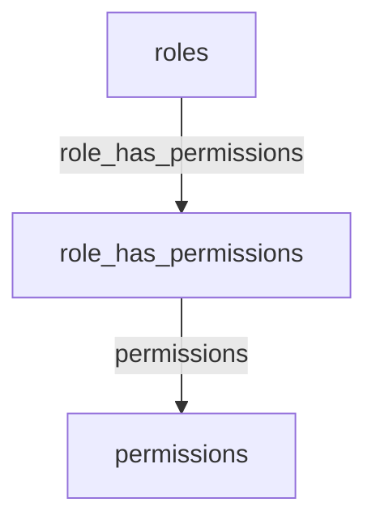

# API RBAC (Roles, Permisos y Relaciones) - Spatie Permission

Estado: diseño de API sin autenticación para entorno de desarrollo.

Guard por defecto: web.

Archivos relacionados:
- [config/permission.php](config/permission.php)
- [routes/api.php](routes/api.php)
- [app/Http/Controllers/RoleController.php](app/Http/Controllers/RoleController.php)
- [app/Http/Controllers/PermissionController.php](app/Http/Controllers/PermissionController.php)
- [app/Http/Controllers/RolePermissionController.php](app/Http/Controllers/RolePermissionController.php)

Prefijo y convenciones:
- Base URL: /api
- Prefijo lógico de módulo: /rbac
- Todas las respuestas son JSON

Estructura de respuesta estándar:
```json
{
  "success": true,
  "data": {},
  "meta": {
    "message": "...",
    "pagination": {
      "current_page": 1,
      "per_page": 15,
      "total": 1,
      "last_page": 1
    }
  }
}
```

Errores:
- 404: recurso no encontrado
- 422: validación fallida
- 409: conflicto por duplicado
- 500: error inesperado

Modelos y guard:
- Role y Permission de Spatie
- guard_name por defecto: web
- Si se envía guard_name debe ser web

Consulta común: paginación y filtros
- Query params: page, per_page, sort, order, q, guard
- sort permitido: name
- order permitido: asc o desc
- per_page máximo: 100

Endpoints - Roles

GET /api/rbac/roles
- Lista paginada de roles
- Query: page, per_page, sort, order, q, guard
Ejemplo respuesta:
```json
{
  "success": true,
  "data": [
    {"id": 1, "name": "admin", "guard_name": "web"}
  ],
  "meta": {
    "pagination": {"current_page": 1, "per_page": 15, "total": 1, "last_page": 1}
  }
}
```

POST /api/rbac/roles
- Crea un rol
Body:
```json
{
  "name": "manager",
  "guard_name": "web"
}
```
Respuestas:
- 201 con objeto creado
- 422 si validación falla
- 409 si existe duplicado en mismo guard

GET /api/rbac/roles/{id}
- Obtiene un rol por id
- 404 si no existe

PUT /api/rbac/roles/{id}
- Actualiza nombre y opcionalmente guard_name
- 404 si no existe, 422 si validation falla, 409 si duplicado

DELETE /api/rbac/roles/{id}
- Elimina un rol
- 404 si no existe

Endpoints - Permisos

GET /api/rbac/permissions
- Lista paginada de permisos
- Query: page, per_page, sort, order, q, guard

POST /api/rbac/permissions
- Crea un permiso
Body:
```json
{
  "name": "posts.publish",
  "guard_name": "web"
}
```

GET /api/rbac/permissions/{id}
- Obtiene un permiso por id

PUT /api/rbac/permissions/{id}
- Actualiza un permiso

DELETE /api/rbac/permissions/{id}
- Elimina un permiso

Endpoints - Relaciones Rol-Permiso

GET /api/rbac/roles/{role_id}/permissions
- Lista permisos asignados al rol
- Query: guard
Respuesta:
```json
{
  "success": true,
  "data": [
    {"id": 10, "name": "posts.view", "guard_name": "web"}
  ]
}
```

POST /api/rbac/roles/{role_id}/permissions/attach
- Asigna uno o más permisos al rol
Body por ids:
```json
{
  "permissions": [1, 2, 3],
  "mode": "by_id",
  "guard_name": "web"
}
```
Body por nombres:
```json
{
  "permissions": ["posts.view", "posts.create"],
  "mode": "by_name",
  "guard_name": "web"
}
```
Notas:
- Operación idempotente: asignar un permiso ya asignado no genera error

POST /api/rbac/roles/{role_id}/permissions/sync
- Sincroniza la lista de permisos del rol con la lista provista
- Misma estructura de body que attach

POST /api/rbac/roles/{role_id}/permissions/detach
- Quita uno o más permisos del rol
- Body igual a attach
- Idempotente: quitar un permiso no asignado no genera error

Reglas de validación
- name: requerido, string, max:255, sin espacios iniciales o finales
- guard_name: in:web; por omisión web
- Unicidad:
  - roles: único por name y guard_name
  - permissions: único por name y guard_name
- role_id y permission ids existen y corresponden al mismo guard_name
- per_page: entero 1..100
- sort: in:name
- order: in:asc,desc
- mode: in:by_id,by_name

Ordenamiento y búsqueda
- sort=name, order=asc por defecto
- q busca por nombre con like

Notas de caché Spatie
- El paquete limpia la caché automáticamente al crear o modificar roles y permisos
- Tras operaciones de attach, detach o sync, la caché también se invalida automáticamente

Ejemplos curl

Listar roles:
```bash
curl -X GET "http://localhost:8000/api/rbac/roles?per_page=10&sort=name&order=asc&q=adm&guard=web"
```

Crear permiso:
```bash
curl -X POST "http://localhost:8000/api/rbac/permissions" \
  -H "Content-Type: application/json" \
  -d '{"name":"posts.publish","guard_name":"web"}'
```

Attach permisos por nombre:
```bash
curl -X POST "http://localhost:8000/api/rbac/roles/1/permissions/attach" \
  -H "Content-Type: application/json" \
  -d '{"permissions":["posts.view","posts.create"],"mode":"by_name","guard_name":"web"}'
```

Especificación de rutas a implementar
- En [routes/api.php](routes/api.php) crear grupo prefix rbac
- Registrar recursos de roles y permissions sin create ni edit
- Registrar endpoints de relación attach, sync y detach

Convenciones de controladores
- [app/Http/Controllers/RoleController.php](app/Http/Controllers/RoleController.php)
- [app/Http/Controllers/PermissionController.php](app/Http/Controllers/PermissionController.php)
- [app/Http/Controllers/RolePermissionController.php](app/Http/Controllers/RolePermissionController.php)

Diagrama Mermaid


Checklist de implementación
- Definir rutas en [routes/api.php](routes/api.php)
- Implementar controladores en app/Http/Controllers
- Responder con estructura estándar y códigos adecuados
- Probar con curl y ajustar detalles